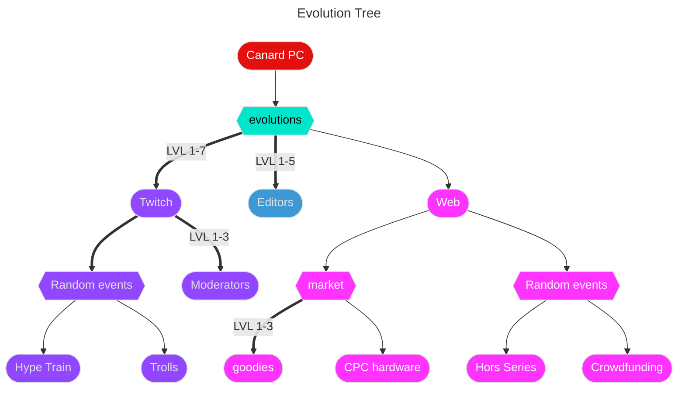
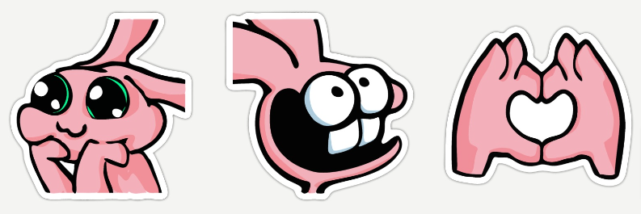
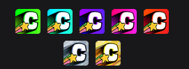

# 
Test

 
 

## Market
 

  ### Goodies

  - Unlock Goodies icon drop
  - Upgrade money by `#smolamount`
  
    #### Levels (1-3)

    - More upgrade === more event + more goodies + more icons differents
    - 

  ### CPC Hardware

  - Unlock CPC Hardware icon drop
  -  /!\ Need special editor /!\
  - Upgrade money by `#bigamount`
    
 
 

## Twitch
 

- Unlock Twitch icon drop
- Upgrade money by `#smolamount`

    ### Levels (1-7)

    - 
    - More upgrade === more event + more trolls appearance
    - Each level has his own color
    - Each level has his own value

 
 

## Editors
 

- Unlock editor selection
- Each editor has unique : 
  - Abilities
  - Automatic click rate (Upgrade money by `#customamount`)
  - Icon
  - Salary

  ### Levels (1-5)

  - More upgrade === more editor hired at the same time

 
 

## Random Events
 

### Web

  - Hors Series (bonus of number of `subscription icons` falling + `#smolamount` of money)
  - Crowdfunding :
  
      - Can be failed if gauge not full when ending
      - Special icon when triggered
      - Only his icon fill the gauge
      - if failed money is lost
      - if succeded all money is earned and x2 (??)

### Twitch

  - Hype train  (bonus of number of `Twitch icons` falling + `#smolamount` of money)
  - Trolls :
  
      - Same `Twitch icons` but cost money instead of earning
      - Special effect when clicked

